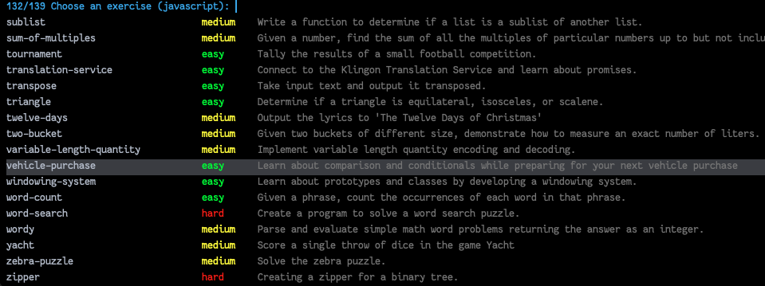

# Preamble
[Exercism](https://exercism.org) is a great tool for learning new languages or diving deeper into familiar ones!

It offers not just a nice web editor but also a CLI if you want to use your local editor of choice. This package aims to streamline the latter, via Emacs!

# Prerequisites
Download the `exercism` CLI by following [the official guide](https://exercism.org/cli-walkthrough).

# Quick Start
- Install - it's available on Melpa!
- Load `exercism` via `(require 'exercism)` or `(use-package exercism)` or equivalent
- Invoke the command `exercism`. It will popup a [transient](https://github.com/magit/transient) menu (similar to our beloved `magit`!)

## `Configure`
[Get your API token](https://exercism.org/settings/api_cli) and pop it into the prompt. This is a once-off configuration (unless you reset your token).

https://user-images.githubusercontent.com/15933322/190892930-2ff737ae-f672-4688-ab0d-7f655508da77.mov

## `Set current track`
  - Choose the track that you want to do exercises for.
  - This might take a few minutes the first time because it "initializes" the track locally. Subsequent invocations will be instant.

https://user-images.githubusercontent.com/15933322/190892892-02f53f4c-07f8-4d85-ad2c-19ff1351c37a.mp4

## `Open an exercise`
Time to get into it! Note that some exercises are actually still locked, yet "select-able" (see the "Known Limitations" section).
Note that you need to have a network connection (since this package needs to query the exercism API). If you need to work offline,
pre-download all the exercises beforehand (see `Download all unlocked exercises`).

## `Download all unlocked exercises`
If you want to do all the exercises locally, you can download them all. Note that this only includes exercises unlocked for you.

## `Open a downloaded exercise`
If you are working offline and have downloaded exercises previously, you can open one of those.

## `Run tests`
Run tests! You can see the results in the `*compilation*` buffer.

(Only for CLI version 3.2.0 onwards, (run `exercism-cli-version` to check))

## `Submit`
Submits the current directory as a solution. Note that to mark the exercise as "completed", you'll have to do it via the web app.

https://user-images.githubusercontent.com/15933322/190892957-b7ae8c3c-40e2-4a81-b737-3e504d18fed8.mp4

## `Submit (then open in browser)`
Similar to `Submit` but automatically opens the exercise in the browser after submission. So if you want to mark your solution as "complete", you'd probably want to use this.

https://user-images.githubusercontent.com/15933322/190892960-8b82c3b8-55f5-4eea-8091-293569f9231a.mp4

# Known Limitations
- Registering yourself to a track isn't currently supported. You'll have to do this via [their web app](https://exercism.org/tracks), sorry!
- The exercises list that you choose from, also includes "not yet unlocked" ones. This is due to the the fact that the CLI doesn't support listing out exercises.

# Contributing
- All PRs, suggestions, complaints and anything in between are welcome!
